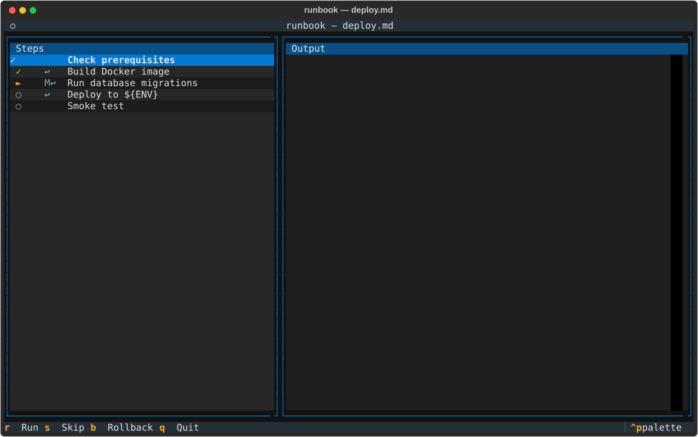

# runbook

Interactive CLI tool to execute runbooks written in Markdown.

Steps are defined with headings and bash code fences. The TUI lets you run,
skip, rollback, and resume steps one at a time.



## Quick start

```bash
pip install -e ".[dev]"
python -m runbook examples/deploy.md
```

The included example (`examples/deploy.md`) demonstrates variables, a manual
confirmation step, and rollback commands. You will be prompted for `ENV` and
`VERSION` before the TUI opens.

## Usage

```
runbook [--reset] <path/to/runbook.md>
```

| Option | Description |
|--------|-------------|
| `--reset` | Discard saved progress and start the runbook from scratch |

### Key bindings

| Key | Action |
|-----|--------|
| `r` | Run the selected step |
| `s` | Skip the selected step |
| `b` | Run the rollback command for the selected step |
| `q` | Quit |

---

## Runbook syntax

### Step structure

A step is an **H2 or H3 heading** followed by a **bash code fence**:

~~~markdown
## Deploy application

```bash
make deploy
```
~~~

Everything between the heading and the bash fence (description text, lists,
non-bash code snippets) is ignored by the parser and only serves as
human-readable documentation.

### Supported bash fence languages

The language tag is matched **case-insensitively**. Accepted values:

| Tag | Example |
|-----|---------|
| `bash` | ` ```bash ` |
| `sh` | ` ```sh ` |
| `shell` | ` ```shell ` |

Capitalised variants like `Bash`, `SH`, `Shell` are all accepted.

Trailing info-string attributes are ignored — only the first word is used:

~~~markdown
```bash title="deploy-step"
make deploy
```
~~~

A fence with **no language tag** is not treated as a bash block and does not
create a step.

### HTML directives

Place HTML comments between the heading and the bash fence.

#### Manual confirmation

```markdown
<!-- runbook:manual -->
```

The step is presented as a manual confirmation gate: the TUI asks the user to
confirm before marking it done. The bash command is still recorded but not
executed automatically.

#### Rollback command

```markdown
<!-- runbook:rollback: make rollback -->
```

Associates a rollback command with the step. Press `b` in the TUI to run it.
The rollback command may contain spaces, flags, and shell variables:

```markdown
<!-- runbook:rollback: kubectl rollout undo deploy/myapp --namespace prod -->
```

#### Multiple directives

Multiple comments can appear between the heading and the fence, separated by
blank lines or not:

~~~markdown
## Deploy

<!-- runbook:manual -->

<!-- runbook:rollback: make rollback -->

```bash
make deploy
```
~~~

When multiple `rollback` comments appear, the **last one** takes precedence.

### Step IDs

Each step gets a stable slug ID derived from its title:

- Lowercased, non-alphanumeric characters removed, spaces → hyphens
- Duplicate titles get a numeric suffix: `deploy`, `deploy-2`, `deploy-3`

Examples:

| Title | ID |
|-------|----|
| `Deploy application` | `deploy-application` |
| `100% complete` | `100-complete` |
| `Step #2` | `step-2` |
| `deploy_app` | `deploy-app` |

### H2 / H3 nesting

H2 and H3 headings are each treated as independent potential steps.

**H2 with no bash, H3 children with bash** — H2 is discarded, H3 steps are
created:

~~~markdown
## Deploy                          ← discarded (no bash fence)

### Run migrations                 ← step created
```bash
python manage.py migrate
```

### Restart service                ← step created
```bash
systemctl restart myapp
```
~~~

**H2 with its own bash AND H3 children** — both create steps, in document
order:

~~~markdown
## Deploy                          ← step created
```bash
echo "starting"
```

### Run migrations                 ← step created
```bash
python manage.py migrate
```
~~~

### Variables

Use `${VAR_NAME}` in commands and rollback commands. The CLI prompts for values
at startup. Simple variable syntax only — bash advanced expansions such as
`${VAR:-default}` or `${VAR#prefix}` are passed through unchanged.

---

## State and resume

Run state is persisted to `.runbook/<name>.state.json` next to the Markdown
file. If the file exists when you launch, the session is resumed automatically.
Variable values from the previous run are reused and shown before the TUI opens.

If the runbook file has changed since the last run, you are prompted to reset
or abort. Pass `--reset` to skip the prompt and discard progress immediately:

```bash
python -m runbook --reset path/to/runbook.md
```

---

## Logs

Each step execution is logged to `.runbook/logs/<step-id>_<YYYYMMDD_HHMMSS>.log`.

Log format:

```
# step:    deploy-application
# title:   Deploy application
# command: make deploy
# started: 2024-06-01T12:00:00+00:00
#
[stdout] Deploying…
[stderr] Warning: slow network
#
# exit_code: 0
# ended:     2024-06-01T12:00:05+00:00
```

The path of the most recent log for each step is also stored in the state JSON.

---

## Unsupported syntax

The following are explicitly **not** supported:

| Construct | Behaviour |
|-----------|-----------|
| H1 headings | Always ignored (document title) |
| H4+ headings | Always ignored |
| Multiple bash fences under one heading | Only the first fence creates a step |
| Non-bash code fences | Skipped; search for bash fence continues |
| Bash fence with no language tag | Skipped |
| Inline code, HTML blocks other than `<!-- runbook:… -->` | Ignored |
| Nested `${VAR:-default}` expansions | Passed through as-is to the shell |

---

## Development

```bash
pip install -e ".[dev]"
pytest
```
